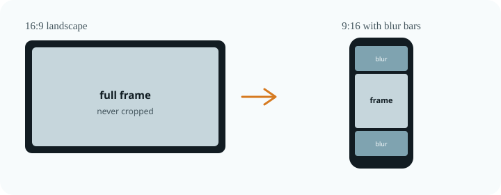
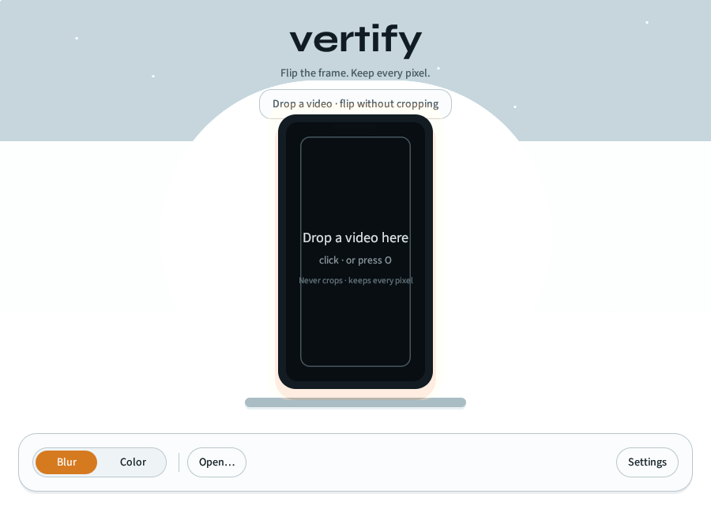
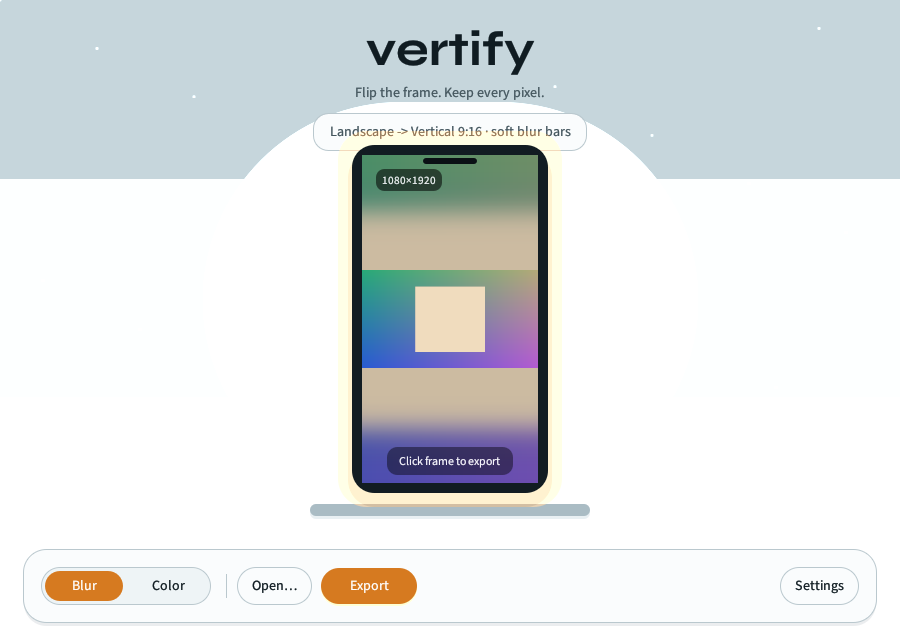

<p align="center">
  
</p>

<h1 align="center">vertify</h1>

<p align="center">
  <strong>Flip 16:9 ↔ 9:16 video without cropping.</strong><br>
  The whole frame stays. Blurred or solid bars fill the rest.
</p>

<p align="center">
  <a href="https://github.com/daylennguyen/vertify/actions/workflows/ci.yml"></a>
  <a href="https://github.com/daylennguyen/vertify/releases/latest"></a>
  <a href="LICENSE"></a>
  <a href="https://www.rust-lang.org/"></a>
  <a href="https://ffmpeg.org/"></a>
  <a href="https://github.com/daylennguyen/vertify/stargazers"></a>
</p>

<p align="center">
  <a href="#install">Install</a> ·
  <a href="#quick-start">Quick start</a> ·
  <a href="#cli">CLI</a> ·
  <a href="#gui-flip-stage">GUI</a> ·
  <a href="#how-it-works">How it works</a> ·
  <a href="#faq">FAQ</a>
</p>

---

Social platforms want **9:16**. Your camera, screen recording, or talk is **16:9**. Cropping throws away half the picture. vertify letterboxes instead: the original frame is scaled to fit, and the empty space is filled with a blurred copy of the same clip (the look used by Reels / Shorts / TikTok) or a solid color.

Landscape in → 9:16 out. Portrait in → 16:9 out. Or force a direction.

<p align="center">
  
</p>

<p align="center">
  
  <br>
  <em>Flip Stage GUI — drop a clip, preview the letterbox, export.</em>
</p>

## Why vertify

| | Crop to 9:16 | Manual ffmpeg | **vertify** |
|---|---|---|---|
| Keeps the whole frame | No | If you write the filter | **Yes** |
| Blurred background bars | DIY | Long `filter_complex` | `--fill blur` |
| Solid color bars | DIY | `pad=` + color | `--fill color --color white` |
| Auto landscape ↔ portrait | No | Probe first | Default |
| Dry-run the exact command | No | You *are* the command | `--dry-run` |
| Desktop preview | No | No | `vertify-gui` |

You still need [ffmpeg](https://ffmpeg.org) **only if you build from source**. Official installers and release zips already include `ffmpeg` and `ffprobe` next to the Vertify binaries.

## Install

Every push to `main` publishes a [GitHub Release](https://github.com/daylennguyen/vertify/releases/latest) with Windows installer, portable zip, and macOS/Linux archives (ffmpeg included).

### Windows (recommended)

1. Download **`VertifySetup-*-windows-x64.exe`** from the [latest release](https://github.com/daylennguyen/vertify/releases/latest).
2. Run the installer. It puts Vertify in `%LOCALAPPDATA%\Programs\Vertify` (no admin prompt) together with ffmpeg.
3. Launch **Vertify** from the Start menu, or run `vertify` in a terminal if you left PATH checked.

Portable option: unzip `vertify-*-windows-x64.zip` and keep `vertify.exe`, `vertify-gui.exe`, `ffmpeg.exe`, and `ffprobe.exe` in the **same folder**. Double-click `vertify-gui.exe`. Do not scatter those files.

ffmpeg is **bundled**. You do not need `winget install ffmpeg`.

### macOS and Linux

Download the archive for your CPU from the [latest release](https://github.com/daylennguyen/vertify/releases/latest), unpack it, and run `./vertify-gui` or `./vertify`. ffmpeg is inside that folder.

```sh
# example — the folder name includes the crate version and short commit
tar -xzf vertify-v0.1.1-b55faf1-macos-arm64.tar.gz
cd vertify-v0.1.1-b55faf1-macos-arm64
./vertify-gui
```

Move the whole folder somewhere stable (e.g. `~/Applications/vertify`) rather than copying a single binary.

### From source (Rust)

Building with Cargo does **not** vendor ffmpeg. Install it yourself, or point Vertify at a folder that contains `ffmpeg` / `ffprobe`:

```sh
# macOS
brew install ffmpeg

# Ubuntu / Debian
sudo apt install ffmpeg

# Windows (winget) — only needed for cargo/source builds
winget install Gyan.FFmpeg
```

```sh
cargo install --git https://github.com/daylennguyen/vertify --locked
# or
git clone https://github.com/daylennguyen/vertify.git
cd vertify
./install.sh          # Unix
.\install.ps1         # Windows
```

Unix prefix install (default `~/.local/bin`) also expects ffmpeg on `PATH`:

```sh
make install
```

Override the search path: `VERTIFY_FFMPEG_DIR=/path/to/ffmpeg-bin vertify talk.mp4`.

### Shell completions

```sh
# bash
vertify --completions bash > /etc/bash_completion.d/vertify
# zsh
vertify --completions zsh  > "${fpath[1]}/_vertify"
# fish
vertify --completions fish > ~/.config/fish/completions/vertify.fish
# PowerShell
vertify --completions powershell >> $PROFILE
```

Checked-in copies live in [`completions/`](completions/).

## Quick start

```sh
# Auto: 16:9 in → 9:16 out (talk_vertical.mp4)
#       9:16 in → 16:9 out (talk_horizontal.mp4)
vertify talk.mp4

# Force vertical, social-style blur
vertify talk.mp4 --to 9:16 --fill blur

# White bars, 4K-class long edge, fastest encode
vertify talk.mp4 --fill color --color white --size 3840 --fast

# Plan as JSON without encoding
vertify talk.mp4 --to 9:16 --json-plan

# See the ffmpeg command without running it
vertify talk.mp4 --dry-run
```

Open the GUI:

```sh
vertify-gui
# or
cargo run --release --bin vertify-gui
```

## CLI

```
vertify [OPTIONS] <INPUT> [OUTPUT]
```

If `OUTPUT` is omitted, vertify writes `<stem>_vertical.mp4` or `<stem>_horizontal.mp4` next to the input.

| Flag | Default | Description |
|------|---------|-------------|
| `-t, --to <auto\|9:16\|16:9>` | `auto` | Target aspect. `auto` flips orientation. Aliases: `vertical`, `horizontal` |
| `-f, --fill <blur\|color>` | `blur` | Empty-space fill |
| `--size <px>` | `1920` | Long edge of the output canvas (1920 = 1080p-class) |
| `--color <name/hex>` | `black` | Bar color for `--fill color` (`black`, `white`, `red`, `green`, `blue`, `gray`, or `#RRGGBB`) |
| `--blur <n>` | `40` | Box-blur radius for `--fill blur` |
| `--preset <preset>` | — | x264 preset (`ultrafast`…`placebo`), overrides `--fast` |
| `--crf <n>` | `21` | x264 quality (lower = better; 18–28 is the usual range) |
| `--fast` | off | `ultrafast` preset (larger file) |
| `--output-dir <dir>` | — | Directory for autogenerated output files |
| `--suffix <text>` | — | Extra suffix for autogenerated output name |
| `-y, --overwrite` | off | Replace an existing output file |
| `--audio-mode <copy\|aac\|none>` | `copy` | Copy audio, force AAC, or drop audio |
| `--audio-bitrate <rate>` | `192k` | AAC bitrate for `aac` mode and copy fallback |
| `--start <time>` | — | Seek into the source before encoding |
| `--duration <time>` | — | Encode only the specified duration |
| `--map-metadata` | off | Copy source metadata into output |
| `--loglevel <quiet\|error\|warning\|info>` | `warning` | ffmpeg log verbosity |
| `--ffmpeg-arg <arg>` | — | Pass extra ffmpeg args (repeatable) |
| `--no-faststart` | off | Disable `+faststart` |
| `--dry-run` | off | Print the ffmpeg command; do not encode |
| `--json-plan` | off | Print resolved conversion plan as JSON and exit |
| `--open` | off | Open output file after successful encode |
| `--completions <shell>` | — | Write completions to stdout (`bash`, `zsh`, `fish`, `powershell`, `elvish`) |

Notes:

- Square input requires an explicit `--to 9:16` or `--to 16:9`.
- If the input already matches the target aspect, vertify warns and re-encodes.
- Audio is stream-copied. If the container rejects that, the encode retries with AAC at 192 kbps.
- Output is H.264 (`libx264`) in MP4 with `+faststart` for web playback.
- Canvas dimensions are forced even so x264 is happy.

```sh
vertify --help
vertify --version
```

## GUI (Flip Stage)

A small desktop app for people who want to *see* the letterbox before committing an encode.

```sh
cargo run --release --bin vertify-gui
```

<p align="center">
  
</p>

- Drop a clip onto the phone frame, or click / press `O` to open.
- The stage shows a letterboxed preview (blur or solid fill).
- Click the frame (or `Enter` / `Space`) to export.
- Open **···** (or `,`) for target, size, quality, color, and dry-run. `Esc` closes it.
- Shift+`?` opens a keyboard shortcuts panel.
- Backstage includes custom long-edge input, target swap, reset-to-defaults, and richer color presets.
- If Dry Run is on, use **Copy command** to copy the exact ffmpeg command.
- After export, use **Open folder** to open the output directory.
- Hover any control for a tooltip. The status line under the brand adds detail on hover.

### Visual tests

```sh
cargo test --test gui_visual -- --test-threads=1
```

Snapshots live in `tests/snapshots/`. Use a single test thread — wgpu snapshot rendering is not safe to parallelize. After intentional UI changes:

```sh
# Unix
UPDATE_SNAPSHOTS=1 cargo test --test gui_visual -- --test-threads=1

# PowerShell
$env:UPDATE_SNAPSHOTS="1"; cargo test --test gui_visual -- --test-threads=1
```

## How it works

1. **Probe** the input with `ffprobe` (width, height, duration).
2. **Resolve** the target: landscape → 9:16, portrait → 16:9, unless `--to` is set.
3. **Size** a canvas whose long edge is `--size` and whose aspect is 9:16 or 16:9 (even pixels).
4. **Filter**
   - **Blur:** split the video, scale+crop a copy to fill the canvas, `boxblur`, scale the original to *fit*, overlay centered.
   - **Color:** scale to fit, `pad` with the chosen color.
5. **Encode** `libx264` (`veryfast` or `ultrafast`), copy audio, `-movflags +faststart`.

`--dry-run` prints that ffmpeg command so you can paste, tweak, or learn from it.

vertify does **not** link against ffmpeg. It is a MIT-licensed Rust frontend. ffmpeg is a separate install with its own license (LGPL/GPL depending on the build).

## Project layout

```
src/main.rs          CLI
src/bin/gui.rs       GUI entry
src/lib.rs           Probe, plan, ffmpeg command, convert()
src/gui/             Flip Stage (egui)
completions/         bash / zsh / fish
assets/fonts/        Syne + Source Sans 3 (OFL)
```

The CLI and GUI call the same `convert()` path. If you change encoding behavior, change it once in `src/lib.rs`.

## Requirements

| | |
|---|---|
| OS | Windows, macOS, Linux |
| Rust | 1.80+ (to build from source) |
| ffmpeg | Bundled in official releases. Source builds need ffmpeg 4.x+ with `libx264` on `PATH` (or `VERTIFY_FFMPEG_DIR`). |

Hardware acceleration is not used. That keeps the filter graph portable. For huge batches, prefer `--fast` or a lower `--size`.

## FAQ

**Do I need to install ffmpeg?**
Not if you use the Windows installer or an official release zip/tarball. ffmpeg ships in the same folder. Source/`cargo install` builds still need ffmpeg on `PATH`.

**Does it crop?**
No. The source is scaled with `force_original_aspect_ratio=decrease` and centered.

**Can I keep 16:9 and just add blur on the sides of a portrait clip?**
Yes — that is the default when the input is taller than it is wide. Or pass `--to 16:9`.

**Why is my file larger?**
You are re-encoding (and often *adding* pixels). Use a higher `--crf` (e.g. 23–26) or `--fast` if size matters more than quality.

**Can I pass extra ffmpeg flags?**
Yes. Repeat `--ffmpeg-arg` for each extra token, for example: `--ffmpeg-arg -pix_fmt --ffmpeg-arg yuv420p10le`. You can still use `--dry-run` to inspect the final command.

**Square video?**
Pass `--to 9:16` or `--to 16:9`. Auto-detect refuses to guess.

## Contributing

See [CONTRIBUTING.md](CONTRIBUTING.md). Please read the [Code of Conduct](CODE_OF_CONDUCT.md).

Bug reports and ideas: [open an issue](https://github.com/daylennguyen/vertify/issues/new/choose). Security: [SECURITY.md](SECURITY.md).

## License

[MIT](LICENSE) © Daylen Nguyen

Bundled GUI fonts (Syne, Source Sans 3) are SIL OFL 1.1 — see [assets/fonts](assets/fonts/README.md). Official releases bundle FFmpeg as a separate GPL program — see [THIRD_PARTY.md](THIRD_PARTY.md).
